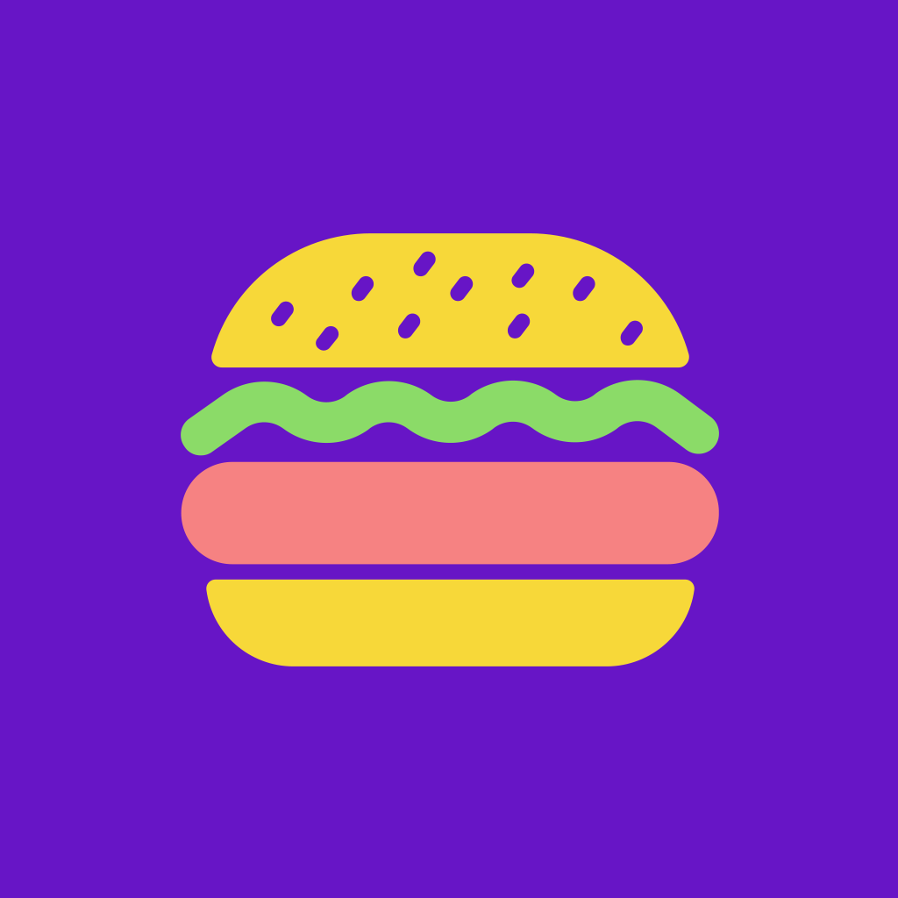
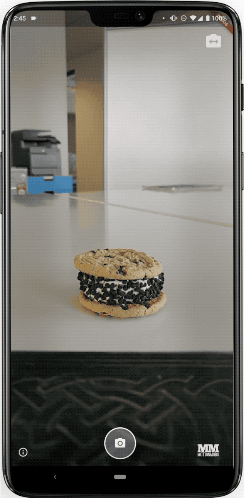
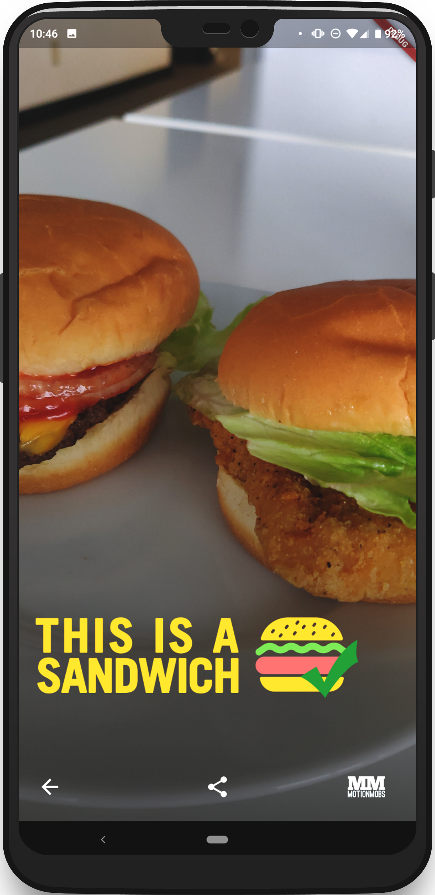
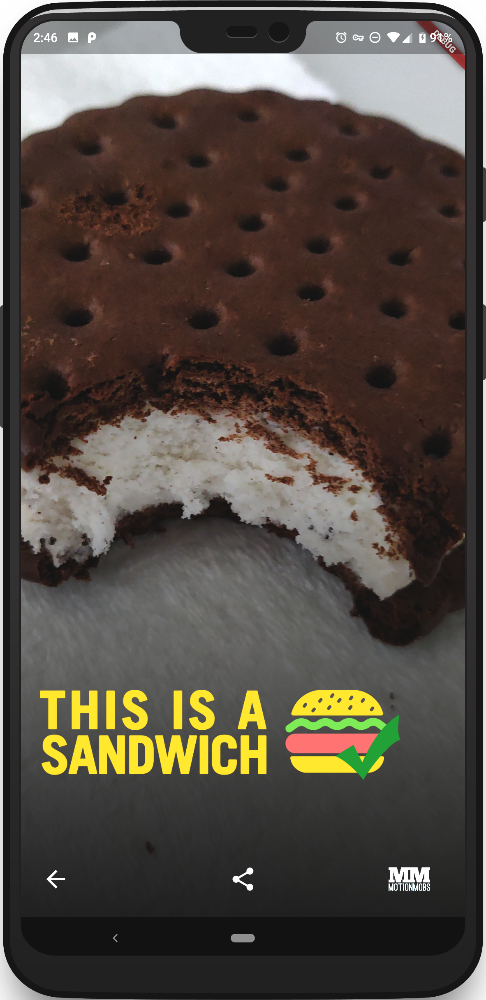
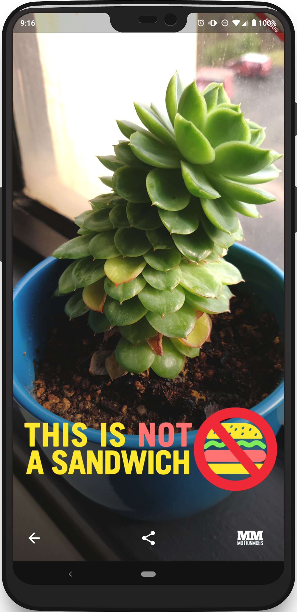

# Sandwhich 


<br />
[Website](https://sandwhich.mm.dev) | [Twitter](https://twitter.com/SandwhichApp)

Sandwhich is a mobile app built to solve the sandwich debate by determining if the picture you've taken is a sandwich using machine learning, [Flutter](https://flutter.dev), and [TensorFlow Lite](https://www.tensorflow.org/lite).

Available on [Google Play](https://play.google.com/store/apps/details?id=dev.mm.sandwhich) and the [App Store](https://itunes.apple.com/us/app/apple-store/id1457568395)

## Screenshots



## Built With

- **Flutter Packages**
  - [tflite](https://pub.dartlang.org/packages/tflite)
  - [image_picker](https://pub.dartlang.org/packages/image_picker)
  - [camera](https://pub.dartlang.org/packages/camera)
  - [path_provider](https://pub.dartlang.org/packages/path_provider)
  - [url_launcher](https://pub.dartlang.org/packages/url_launcher)
  - [flutter_svg](https://pub.dartlang.org/packages/flutter_svg)
  - [simple_share](https://pub.dartlang.org/packages/simple_share)
  - [flare_flutter](https://pub.dartlang.org/packages/flare_flutter)
  - [flutter_launcher_icons](https://pub.dartlang.org/packages/flutter_launcher_icons)
  - [splashscreen](https://pub.dartlang.org/packages/splashscreen)
- **Flare by 2Dimensions**
  - Link to our [flare file](https://www.2dimensions.com/a/wade/files/flare/sandwich) 🤷‍♂️
- **Google Fonts**
  - [Roboto Mono](https://fonts.google.com/specimen/Roboto+Mono)
  - [Rubik](https://fonts.google.com/specimen/Rubik)

## Getting Started

### Building from Source

Clone the repository

```bash
git clone https://github.com/MotionMobs/Sandwhich
cd Sandwhich
```

Run Sandwhich

```bash
flutter run
```

### Train Your Model/ How To 🚋 Your 🥪

To train your 🥪, you need to install [Docker](https://www.docker.com/).

Set up file structure for your images

```shell
training_images
│   ├── input
│   │   ├── not-sandwich
│   │   │   ├── processed  # processed *not-sandwich* images
│   │   │   └── unprocessed  # _original_, not yet processed *not-sandwich* images
│   │   ├── sandwich
│   │   │   ├── processed  # processed *sandwich* imagess
│   │   │   └── unprocessed  # _original_, not yet processed *sandwich* images
│   ├── output  # ready for model
│   │   ├── not-sandwich  # minimum 20 images to train
│   │   └── sandwich  # minimum 20 images to train
└──
```

Once original images are loaded into the folders, as described above, process the images

```bash
cd training_images
./conversion.sh
```

After all images have been processed we need to build the Docker image, run the script to retrain the model, and run the script to convert the retrained model to a `.tflite` model we can use in the app.

Go back to the root of the project and run: 

```bash
cd -
./train.sh
```

Prepare to wait a while.

#### Testing
To test the new model, run `./test_model.sh $IMAGE_PATH` where `$IMAGE_PATH` is any path to an image you want to test with. For convenience, you can even drag an image into the terminal to have its path placed at the end of whatever is currently in the terminal.

- When ready to use the new model, move it to the assets folder and overwrite the old model. Backup old model if desired.
- Run the app, find some sandwiches, and enjoy!

### To release on Android:

`flutter build apk --target-platform android-arm64`

## Team

<a href='https://motionmobs.com'></a>

## Credits

[Sandwhich icon](https://thenounproject.com/term/burger/947537/) was created by [Chad Remsing](https://thenounproject.com/remsing/) from the [Noun Project](https://thenounproject.com/)
